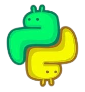

# MaxPyGame
*A Engine made in Python, with Python & PyGame for PyGame*

[](./engine-icon.png)

# Requirements
```shell
python -m pip install pygame
```

# Installation


# ToDo
- [ ] TextArea Widget;
- [ ] Optimization;
- [ ] Text Border;
- [x] [Colors Json](https://mrjuaumbr.github.io/data/colors.json);
- [x] Colors aliases;
- [ ] [Spritesheet System](https://www.pygame.org/wiki/Spritesheet);
- [x] [Engine Default Icon](#icon);
- [ ] Dropdown Widget;

# Colors
The engine has 67 Built-in colors!
and some aliases, in capitalized(Starts with ther *first* letter in UPPER, and in Lower, is all in lower case)
```py
# Example
pygameengine.Colors.BLACK
pygameengine.Colors.Black
pygameengine.Colors.black
```

# Widgets
Currently the engine has some widgets
- Button;
- Checkbox;
- Slider;
- Select;

# Prompts
```shell
# pre-build setup.py
py setup.py build

# Build Packages
py -m build

# Src Build
py -m build --sdist

# Local Install
pip install .

# Local Update
pip install . --update

# Send to testPyPi
twine upload --repository-url https://test.pypi.org/legacy/ dist/*
twine upload --repository testpypi dist/*

```

# Contacts
[YouTube](https://www.youtube.com/@mrjuaumbr)

[GitHub](https://github.com/MrJuaumBR)

[TestPyPi](https://test.pypi.org/user/MrJuaumBR/)

[Discord](https://discord.gg/fb84sHDX7R)