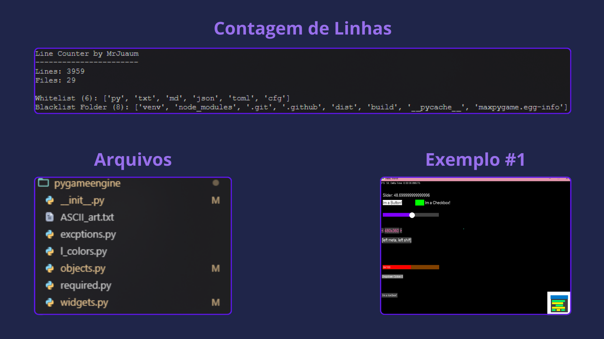

<link rel="stylesheet" href="https://cdn.jsdelivr.net/npm/bootstrap-icons@1.11.3/font/bootstrap-icons.min.css">


# MaxPyGame


*A Engine made in Python, with Python & PyGame for PyGame*

The idea for creating this project is to make more easier to develop in PyGame without having to make multiples "widgets" and some functions every time when you will create a project.<br>
Currently we have multiple functions for use, like: CreateSreen, CreateSysFont, CreateFont and etc...<br>
for the future we want to improve perfomance and have how many functions that you can imagine!<br>
Over +3000 Lines of pure code!

<button style="background-color: #232323; color: #C7C1C1; border-radius: 10px">[<i class="bi bi-window"></i> Test PyPi](https://test.pypi.org/project/maxpygame/)</button>

<button style="background-color: #232323; color: #C7C1C1; border-radius: 10px">[<i class="bi bi-window"></i> GitHub](https://github.com/MrJuaumBR/maxpygame)</button>

[](https://raw.githubusercontent.com/MrJuaumBR/maxpygame/main/engine-icon.png)

*A bug found? A Tip? A Idea? Please make a issue in this Github page*

# Requirements
*! Versions ≥ 0.1.7 will automatically install dependencies*
```shell
python -m pip install pygame
```

# Installation
```shell
pip install -i https://test.pypi.org/simple/ maxpygame
```
*! Update*
```shell
pip install -U -i https://test.pypi.org/simple/ maxpygame
```

# TODO
*! ToDo List moved to [TODO.md](./TODO.md)*

# Colors
The engine has 84 Built-in colors!
and some aliases, in capitalized(Starts with ther *first* letter in UPPER, and in Lower, is all in lower case)
```py
# Example
pygameengine.Colors.BLACK
pygameengine.Colors.Black
pygameengine.Colors.black
```
To get color RGB or Hex:

```py
# RGB
pygameengine.Colors.BLACK.rgb # → Tuple[int,int,int] = 0,0,0
pygameengine.Colors.BLACK._rgb.rgb() # → Tuple[int,int,int] = 0,0,0

# Hex
pygameengine.Colors.WHITE.hex # → String = '#fff' or 'fff'
pygameengine.Colors.WHITE._hex.ghex() # → String = '#fff' or 'fff'
```

# Widgets
Currently the engine has some widgets
- Button;
- Checkbox;
- Slider;
- Select;
- LongText;
- ProgressBar;
- TextBox;
- TextArea;
- DropDown;

# Functionalities
- Input Query;
- Time System;
- Delta Time;
- Input System;
- Machine Info Getter;
- Widgets;
- Mouse Trail;
- Basic Functions of PyGame;
- Screen Resize Detector;
- Own Color System;
- And More...

# Credits
- [PyGame](https://www.pygame.org/news) for developing the base lib;
- @MrJuaumBR for trying to make more easier to create games;
- @vendramin96 for testing and giving tips.

# Contacts
[YouTube](https://www.youtube.com/@mrjuaumbr)

[GitHub](https://github.com/MrJuaumBR)

[Site](https://mrjuaumbr.github.io)

[TestPyPi](https://test.pypi.org/user/MrJuaumBR/)

[Discord](https://discord.gg/fb84sHDX7R)

# Prompts
<br>

<br>
*Ignore*
<br>

